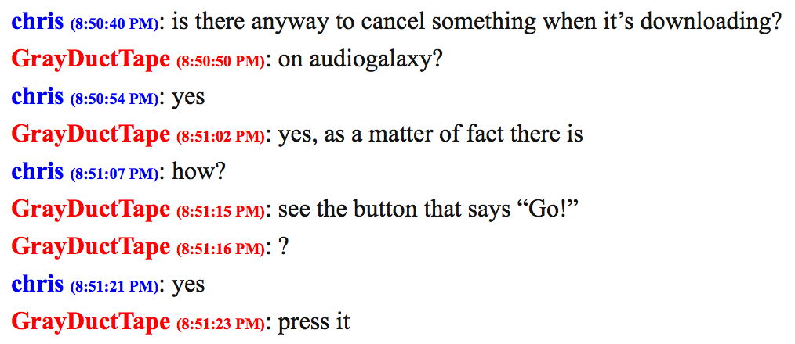

IM-porter
=========

Import IM conversation transcripts to WordPress.

Problem: You have years' worth of chat transcripts saved on your computer, and you'd love to stroll down memory lane and reread some of them, but how?  Manually open each one in your browser or chat program?? There's got to be a better way!

Solution: Install IM-porter, the WordPress plugin that imports your instant message transcripts to your WordPress blog so you can read through conversations from ages past just as easily as you browse the archives of a blog.

After activating the plugin, visit Tools > Import > Chat Transcripts. Then, you can upload a single transcript or a ZIP of transcripts.

Currently supports transcripts from:

* AOL Instant Messenger
* MSN Messenger
* Colloquy
* Adium

Imported posts are given the 'chat' post format, and you have the option of tagging them with the participants' usernames, making them public or private, and adding them to a category.

The output may not be perfect. (The output will not be perfect.)  The original raw transcript is saved as post meta so the post can be updated later if you want.

If you want to style your chats like AIM used to display them (like in the screenshot I included), you can use this CSS:

	.post.format-chat .entry-content p {
		margin-bottom: 0 !important;
	}

	.post.format-chat .entry-content span {
		color: #00f;
		font-weight: bold;
	}

	.post.format-chat .entry-content span.participant-1 {
		color: #f00;
	}

	.post.format-chat .entry-content span time {
		font-size: x-small;
	}

To write your own importer for a given transcript format, write a class that implements the functions in `Chat_IMporter_Format` and add it to the array filtered by the `chat_importer_formats` filter.  See `Chat_IMporter_Format_AIM_HTML` for an example.